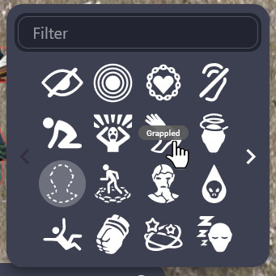
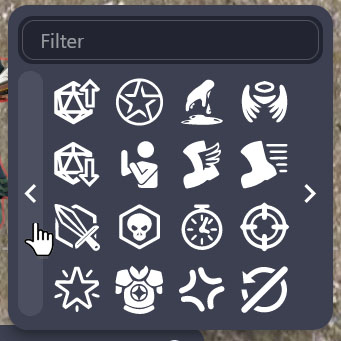
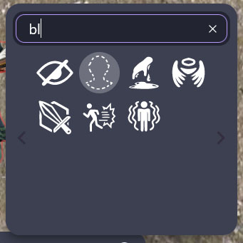
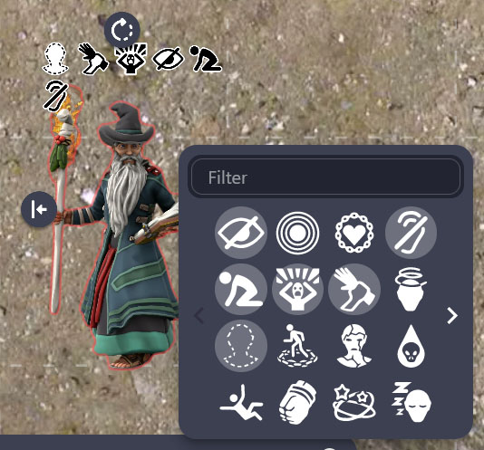

# Condition Markers

Quickly add condition markers to your characters to keep track of concentration, grapples, invisibility, etc.

Credit for the marker designs goes to /u/JinxShadow on Reddit!

## Installing

The extension can be installed from the [store page](https://extensions.owlbear.rodeo/condition-markers).

## How it Works

This project is a simple Typescript app, which works similarly to the [Colored Rings](https://extensions.owlbear.rodeo/colored-rings) extension by Owlbear Rodeo.

The background script background.ts communicates with Owlbear Rodeo to create a context menu item, and when that item is clicked a popup is shown with the main.ts site rendered.

The main.ts site displays an interface of 16 icons at a time. These 16 icons can be clicked, which will display a transparent white overlay to indicate they are currently selected. Hovering over them will display their name. 

There are 4 pages of icons, which you can cycle through by clicking the left and right arrows on either side of the icons.

You can also filter the icons by typing in the name in the filter box. Clearing this box will bring you back to the page you were on.

As you select multiple icons, they will display in a grid-like fashion over the selected character starting at the top left, with a minimum of 5 on a side.

## Building

## Known Issues

## License

## Contributing
