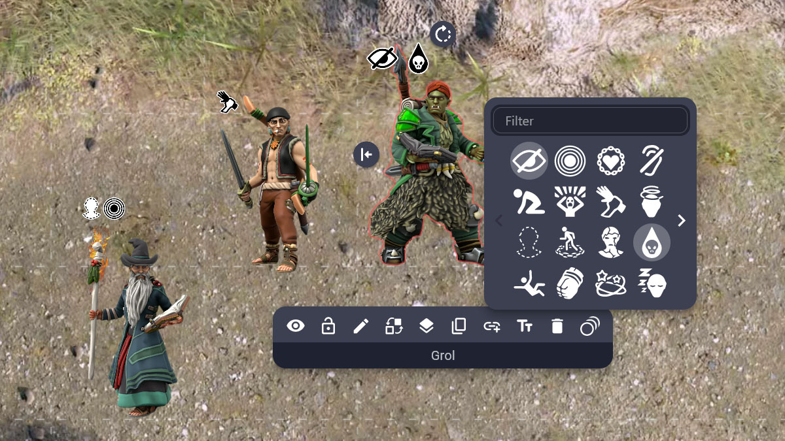

# Condition Markers

Add condition markers to any character to keep track of things like grapples, exhaustion, invsibility, etc.

Credit for the marker designs goes to /u/JinxShadow on Reddit!

## Installing

The extension can be installed from the [store page](https://extensions.owlbear.rodeo/condition-markers).

## How it Works

## Building

## License

## Contributing
